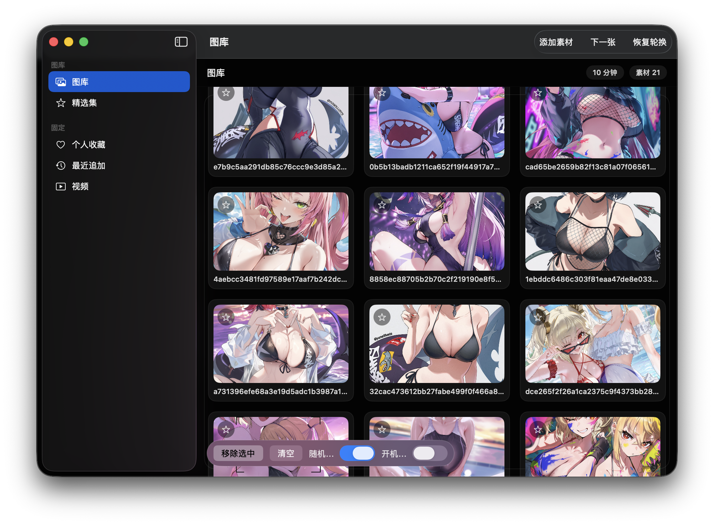

# WallpaperApp

原生 macOS SwiftUI 壁纸应用，支持本地图片/视频、定时轮换、多显示器、开机自启。



## 依赖
- macOS 14+
- Xcode 15+（或 Swift 5.9+ 的 SwiftPM）

## 编译与运行

### 方式 A：SwiftPM
```bash
swift build --disable-sandbox
swift run --disable-sandbox
```

### 方式 B：Xcode
```bash
open Package.swift
```
打开后选择目标 `WallpaperApp`，点击 Run。

### 受限环境下的构建（如果提示缓存目录不可写）
```bash
export TMPDIR=/tmp
export CLANG_MODULE_CACHE_PATH=/tmp/clang-module-cache
export SWIFTPM_CACHE_PATH=/tmp/swiftpm-cache
swift build --disable-sandbox
swift run --disable-sandbox
```

## 打包 .app
```bash
export TMPDIR=/tmp
export CLANG_MODULE_CACHE_PATH=/tmp/clang-module-cache
export SWIFTPM_CACHE_PATH=/tmp/swiftpm-cache
swift build --disable-sandbox

APP=WallpaperApp.app
rm -rf "$APP"
mkdir -p "$APP/Contents/MacOS" "$APP/Contents/Resources"
cp .build/debug/WallpaperApp "$APP/Contents/MacOS/WallpaperApp"
chmod +x "$APP/Contents/MacOS/WallpaperApp"
cp Assets/AppIcon.icns "$APP/Contents/Resources/AppIcon.icns"
cat <<'PLIST' > "$APP/Contents/Info.plist"
<?xml version="1.0" encoding="UTF-8"?>
<!DOCTYPE plist PUBLIC "-//Apple//DTD PLIST 1.0//EN" "http://www.apple.com/DTDs/PropertyList-1.0.dtd">
<plist version="1.0">
<dict>
    <key>CFBundleDevelopmentRegion</key>
    <string>en</string>
    <key>CFBundleExecutable</key>
    <string>WallpaperApp</string>
    <key>CFBundleIdentifier</key>
    <string>com.example.WallpaperApp</string>
    <key>CFBundleInfoDictionaryVersion</key>
    <string>6.0</string>
    <key>CFBundleName</key>
    <string>WallpaperApp</string>
    <key>CFBundlePackageType</key>
    <string>APPL</string>
    <key>CFBundleShortVersionString</key>
    <string>0.1.0</string>
    <key>CFBundleVersion</key>
    <string>1</string>
    <key>CFBundleIconFile</key>
    <string>AppIcon</string>
    <key>LSMinimumSystemVersion</key>
    <string>14.0</string>
    <key>NSHighResolutionCapable</key>
    <true/>
</dict>
</plist>
PLIST
```

运行：
```bash
open WallpaperApp.app
```

## Login Item 签名说明（开机自启）
`SMAppService.mainApp` 需要应用已签名才能稳定注册：

1. 使用 Xcode 打开 `Package.swift`
2. 在目标设置里选择你的开发者账号进行签名
3. 勾选 `Hardened Runtime`（推荐）
4. 运行一次应用后再尝试开启“开机自启”

本地测试也可以使用自签：
```bash
codesign --force --deep --sign - WallpaperApp.app
```

## 使用说明
1. 打开应用后点击“添加素材”，选择本地图片或视频/文件夹。
2. 在右侧设置轮换间隔、随机播放、开机自启。
3. 点击“下一张”可立即切换。
4. 手动选择视频后会暂停自动轮换，点“恢复轮换”继续。

## 说明
- UI 使用系统 `Material` 实现玻璃质感，后续可替换为 macOS 26 的液态玻璃 API。
- 多显示器与多桌面空间已支持。
